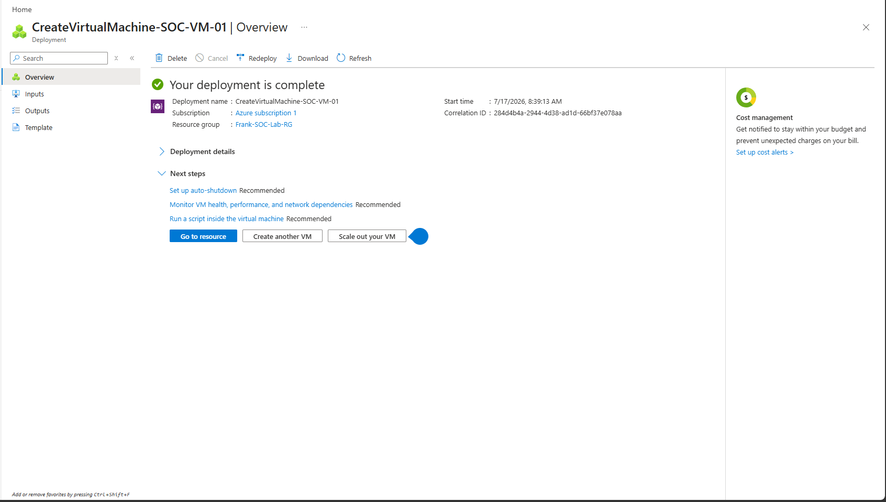
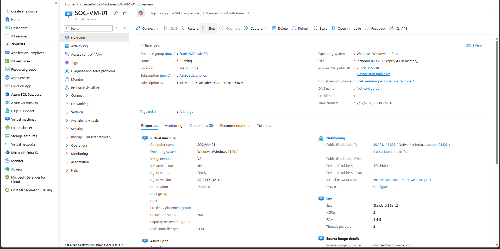

# Windows Virtual Machine Deployment

## Project Objective

The objective of this phase was to deploy a Windows 11 virtual machine in Microsoft Azure to serve as the endpoint for the SOC lab. This virtual machine will later be onboarded to Microsoft Sentinel to generate, collect, and analyze security events during threat detection and incident response exercises.

---

## Why a Virtual Machine?

A virtual machine provides a realistic endpoint for simulating user activity and security events. It enables Microsoft Sentinel to collect telemetry such as:

- Windows Security Event Logs
- Authentication events
- Process creation events
- Network connections
- PowerShell activity
- Defender security events

These logs will later be queried using Kusto Query Language (KQL) to investigate security incidents.

---

## Configuration

| Setting | Value |
|---------|-------|
| Resource Group | Frank-SOC-Lab-RG |
| Virtual Machine | SOC-VM-01 |
| Operating System | Windows 11 Pro (25H2) |
| Region | West Europe |
| VM Size | Standard B2ls v2 |
| Architecture | x64 |
| Authentication | Username & Password |
| Network Security | RDP (3389) Enabled |
| OS Disk | Standard SSD |
| Public IP | Assigned |
| Virtual Network | vnet-westeurope-1 |
| Subnet | snet-westeurope-1 |

---

## Deployment Process

The virtual machine was deployed successfully using the Azure Portal.

During deployment:

- A new Virtual Network (VNet) was created.
- A dedicated subnet was created.
- A public IP address was assigned for remote administration.
- Standard SSD storage was selected for the operating system disk.
- Remote Desktop Protocol (RDP) was enabled for secure remote access.
- Azure automatically provisioned the compute, networking, and storage resources required by the VM.

After validation, the deployment completed successfully without errors.

---

## Deployment Completed

The deployment summary confirms that Azure successfully provisioned all required resources for the virtual machine.

---

## Virtual Machine Overview

After deployment, the virtual machine entered the **Running** state and was assigned its networking configuration, operating system, and compute resources.

This confirms that the VM is operational and ready to be onboarded into Microsoft Sentinel for security monitoring.

---

## Skills Demonstrated

- Microsoft Azure Virtual Machines
- Azure Resource Groups
- Virtual Networking (VNet & Subnets)
- Public IP Configuration
- Azure Compute Services
- Windows Endpoint Deployment
- Remote Desktop (RDP) Configuration
- Cloud Infrastructure Provisioning

---

## Lessons Learned

Deploying an Azure Virtual Machine involves more than simply creating a server. Azure automatically provisions the underlying compute, networking, storage, and security resources required to host the operating system.

This virtual machine will serve as the primary endpoint in the SOC lab. In the next phase, it will be connected to Azure Monitor and Microsoft Sentinel to collect Windows Security Event Logs, enabling threat hunting, detection engineering, and incident investigations using Kusto Query Language (KQL).
