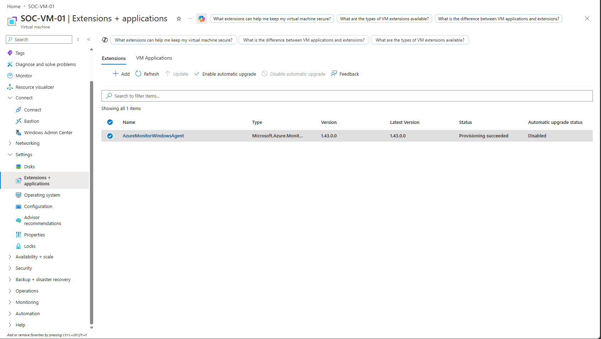

# Azure Monitor Agent Deployment

## Project Objective

The objective of this phase was to deploy and verify the Azure Monitor Agent (AMA) on the Windows 11 virtual machine. The Azure Monitor Agent enables the collection of telemetry and Windows event logs, which are forwarded to Azure Monitor through Data Collection Rules (DCRs) for centralized monitoring and analysis in Microsoft Sentinel.

This step is essential in establishing secure and reliable communication between the monitored endpoint and the cloud-based SIEM.

---

## Overview

The Azure Monitor Agent (AMA) is Microsoft's modern monitoring agent designed to collect telemetry from Azure and hybrid environments. It replaces the legacy Microsoft Monitoring Agent (MMA) and provides improved performance, flexibility, and scalability.

Within this SOC lab, the Azure Monitor Agent is responsible for collecting endpoint telemetry, including Windows Security Events, and forwarding that data to the Log Analytics Workspace for analysis by Microsoft Sentinel.

---

## Deployment Configuration

| Setting | Value |
|----------|-------|
| Virtual Machine | SOC-VM-01 |
| Operating System | Windows 11 |
| Extension | AzureMonitorWindowsAgent |
| Publisher | Microsoft.Azure.Monitor |
| Extension Version | 1.43.0.0 |
| Provisioning Status | Provisioning succeeded |

---

## Deployment Process

The Azure Monitor Agent was deployed through the Azure Portal by adding the AzureMonitorWindowsAgent extension to the Windows virtual machine.

After installation, Azure provisioned the extension successfully, confirming that the virtual machine is capable of collecting monitoring data and securely forwarding it to Azure Monitor.

The deployment provides the foundation required for Data Collection Rules to collect Windows Security Events and other telemetry used by Microsoft Sentinel for threat detection and incident investigation.

---

## Azure Monitor Agent Successfully Installed

The screenshot below confirms that the Azure Monitor Agent extension has been successfully deployed to the virtual machine.

- Extension Name: AzureMonitorWindowsAgent
- Version: 1.43.0.0
- Status: Provisioning succeeded

---

## Skills Demonstrated

- Azure Virtual Machine Administration
- Azure Monitor Agent Deployment
- Azure Extension Management
- Endpoint Monitoring
- Cloud Infrastructure Management
- Microsoft Sentinel Configuration

---

## Lessons Learned

Deploying Microsoft Sentinel alone does not enable endpoint monitoring. The Azure Monitor Agent must be installed on monitored systems before telemetry can be collected.

The agent itself does not determine which logs are collected. Instead, it works together with Data Collection Rules (DCRs), which specify the data sources and the destination Log Analytics Workspace.

Understanding the relationship between the Azure Monitor Agent and Data Collection Rules is critical when troubleshooting missing logs in Microsoft Sentinel.

---

## Why This Matters in a SOC

Security Operations Centers rely on endpoint telemetry to detect malicious activity such as failed logon attempts, privilege escalation, malware execution, and unauthorized system changes.

The Azure Monitor Agent serves as the endpoint component responsible for collecting this security telemetry and securely transmitting it to Azure Monitor. Without the agent, Microsoft Sentinel would not receive the endpoint data required for threat detection, investigation, and incident response.

This deployment establishes the first stage of the security monitoring pipeline within the Microsoft Sentinel SOC Lab.
