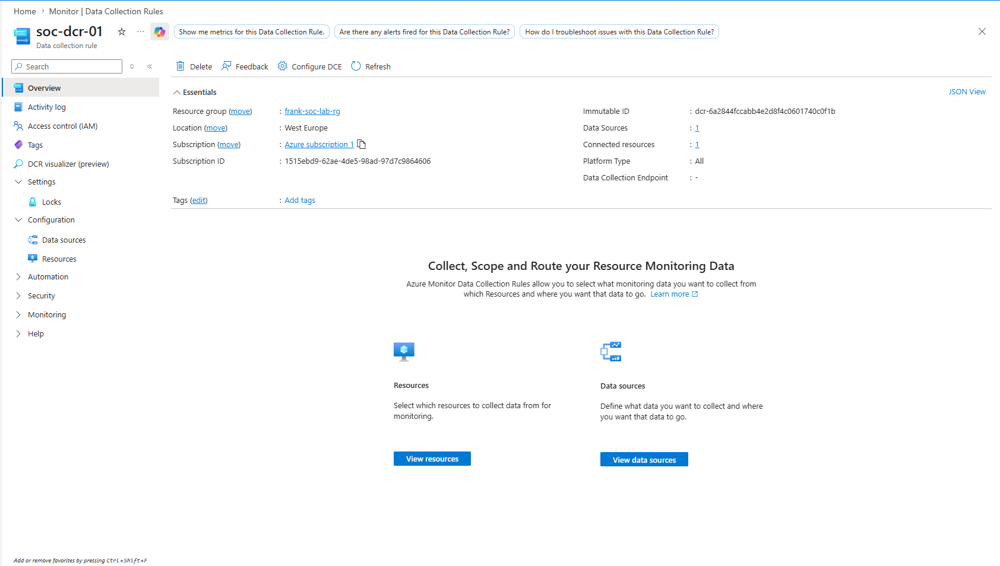
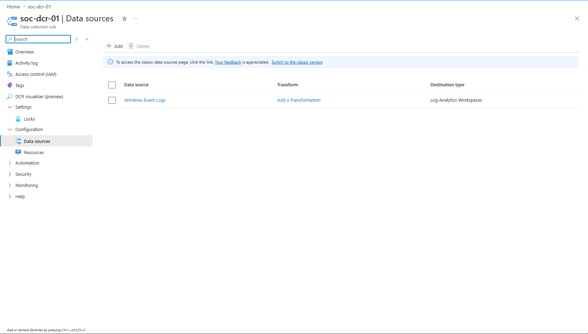
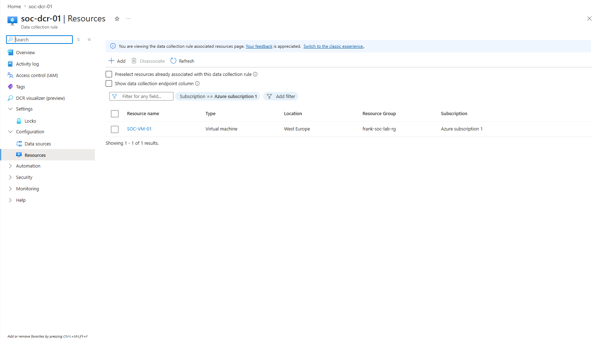
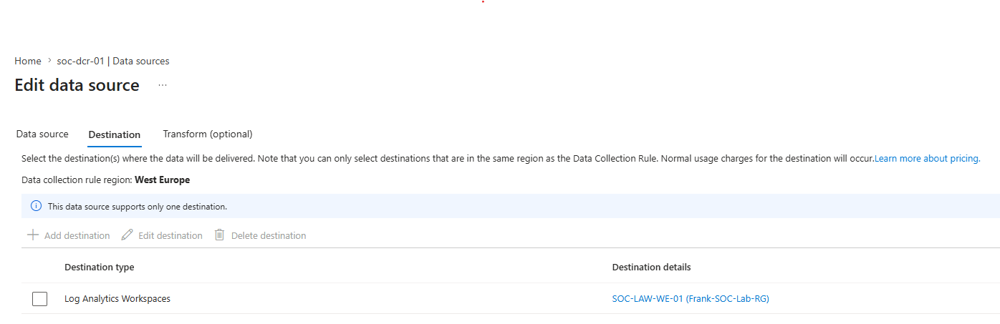

# Data Collection Rule

## Project Objective

The objective of this phase was to configure and verify a Data Collection Rule (DCR) for the Windows 11 virtual machine. The Data Collection Rule defines what telemetry the Azure Monitor Agent collects and where the collected data is sent.

In this SOC lab, the DCR was configured to collect Windows Event Logs and forward them to the Log Analytics Workspace, where Microsoft Sentinel can analyze the data for threat detection, monitoring, and incident investigation.

---

## Why Data Collection Rules?

A Data Collection Rule (DCR) is a core component of Azure Monitor. While the Azure Monitor Agent is responsible for collecting telemetry from monitored endpoints, the Data Collection Rule determines:

- Which resources are monitored
- Which data sources are collected
- Where the collected data is sent

This separation between data collection and configuration provides greater flexibility, centralized management, and simplified administration across multiple monitored resources.

Without a Data Collection Rule, the Azure Monitor Agent would not know what information to collect or where to forward it.

---

## Configuration

| Configuration | Value |
|--------------|-------|
| Data Collection Rule | soc-dcr-01 |
| Region | West Europe |
| Platform | All |
| Connected Resources | 1 |
| Data Sources | Windows Event Logs |
| Destination | SOC-LAW-WE-01 Log Analytics Workspace |

---

## Deployment

The Data Collection Rule was created using Azure Monitor and associated with the Windows virtual machine (**SOC-VM-01**).

The rule was configured to collect Windows Event Logs and securely forward the collected telemetry to the **SOC-LAW-WE-01** Log Analytics Workspace. This configuration enables Microsoft Sentinel to ingest endpoint telemetry for security monitoring and analytics.

---

## Data Collection Rule Overview

The overview page confirms the successful creation of the Data Collection Rule and provides details about the monitored resources and configured data sources.

---

## Data Sources

The Data Collection Rule is configured to collect Windows Event Logs. These logs provide valuable security telemetry, including authentication events, account management activities, and other operating system events required for security monitoring.

---

## Resource Association

The Data Collection Rule is associated with the Windows virtual machine **SOC-VM-01**, ensuring that telemetry generated by the endpoint is collected by the Azure Monitor Agent.

---

## Destination Workspace

The collected telemetry is forwarded to the **SOC-LAW-WE-01** Log Analytics Workspace, which serves as the central repository for monitoring data used by Microsoft Sentinel.

---

## Skills Demonstrated

- Azure Monitor Configuration
- Data Collection Rule Deployment
- Endpoint Monitoring Configuration
- Windows Event Log Collection
- Azure Log Analytics Integration
- Microsoft Sentinel Data Ingestion

---

## Lessons Learned

The Azure Monitor Agent and the Data Collection Rule work together to enable centralized monitoring.

While the Azure Monitor Agent is responsible for collecting endpoint telemetry, the Data Collection Rule determines which logs are collected and where they are sent. Properly configuring both components is essential for successful log ingestion into Microsoft Sentinel.

Understanding this relationship is important when troubleshooting missing logs or validating endpoint monitoring configurations.

---

## Why This Matters in a Security Operations Center (SOC)

Security Operations Centers depend on accurate and timely telemetry from monitored endpoints to identify suspicious activity and respond to security incidents.

The Data Collection Rule ensures that relevant Windows Event Logs are collected and delivered to the Log Analytics Workspace, where Microsoft Sentinel can execute analytics rules, generate alerts, support investigations, and provide centralized visibility across monitored systems.

Properly configured Data Collection Rules are therefore a fundamental component of an effective cloud-native Security Information and Event Management (SIEM) solution.
