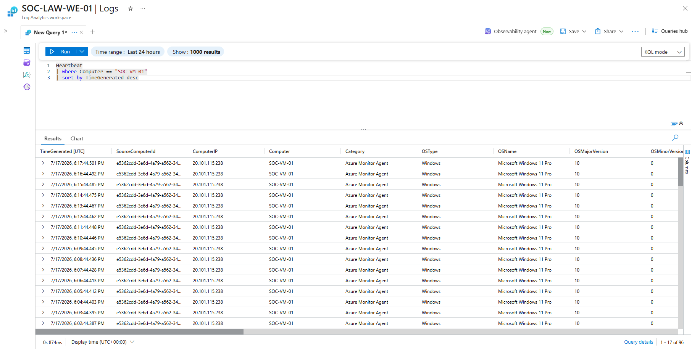
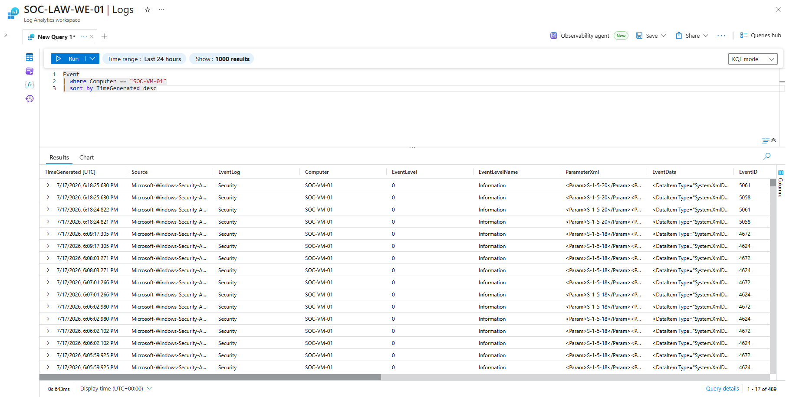
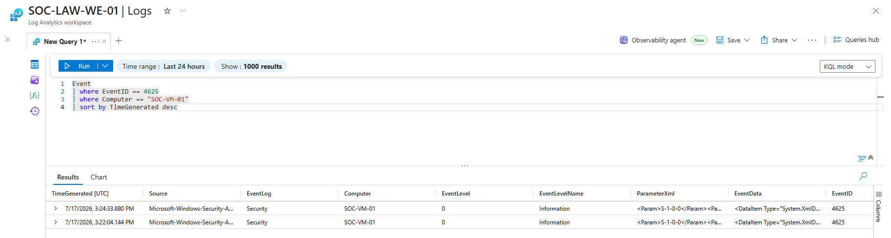

# Log Ingestion Verification

## Project Objective

The objective of this phase was to verify that telemetry generated by the Windows 11 virtual machine was successfully reaching the Log Analytics Workspace through the Azure Monitor Agent and Data Collection Rule.

Successful log ingestion confirms that Microsoft Sentinel is receiving endpoint data required for security monitoring, threat detection, and incident investigation.

---

## Why Log Verification?

After deploying the Azure Monitor Agent and configuring the Data Collection Rule, it is important to validate that telemetry is flowing correctly through the monitoring pipeline.

Verifying log ingestion confirms that:

- The Azure Monitor Agent is communicating with Azure Monitor.
- The Data Collection Rule is collecting the intended data.
- The Log Analytics Workspace is receiving endpoint telemetry.
- Microsoft Sentinel has access to the required data for analytics and alerting.

Without this verification, detection rules and investigations would not function correctly.

---

## Verification Process

The verification process consisted of three stages:

1. Confirming the Azure Monitor Agent heartbeat.
2. Verifying Windows Event Log ingestion.
3. Confirming failed logon events (Event ID 4625) were successfully collected.

---

## Heartbeat Verification

A Kusto Query Language (KQL) query was executed against the **Heartbeat** table to verify that the monitored endpoint was actively communicating with Azure Monitor.

The results confirmed that **SOC-VM-01** was regularly sending heartbeat messages to the Log Analytics Workspace.

```kusto
Heartbeat
| where Computer == "SOC-VM-01"
| sort by TimeGenerated desc
```



---

## Windows Event Log Verification

The Windows Event Logs were queried to verify that security-related events were successfully ingested into the Log Analytics Workspace.

The returned results confirmed that Windows Security events generated by **SOC-VM-01** were available for analysis.

```kusto
Event
| where Computer == "SOC-VM-01"
| sort by TimeGenerated desc
```



---

## Failed Logon Verification

To validate security event collection, multiple failed authentication attempts were generated on the virtual machine.

A KQL query filtering **Event ID 4625** successfully returned failed logon events, confirming that authentication failures were being collected and stored within the Log Analytics Workspace.

```kusto
Event
| where EventID == 4625
| where Computer == "SOC-VM-01"
| sort by TimeGenerated desc
```



---

## Skills Demonstrated

- Azure Monitor Validation
- Microsoft Sentinel Log Analysis
- Kusto Query Language (KQL)
- Windows Security Event Monitoring
- Security Log Verification
- Endpoint Telemetry Analysis

---

## Lessons Learned

Successful deployment of Azure Monitor components does not guarantee that telemetry is being collected. Log ingestion should always be verified before implementing detection rules.

Using KQL to validate heartbeat data, Windows Event Logs, and authentication events ensures that the monitoring pipeline is functioning correctly and that Microsoft Sentinel has the required visibility into monitored endpoints.

---

## Why This Matters in a Security Operations Center (SOC)

A Security Operations Center depends on accurate and timely telemetry to detect threats and investigate suspicious activity.

Verifying log ingestion ensures that endpoint data is continuously collected and available for analytics, alert generation, and incident response.

This validation confirms that the Microsoft Sentinel environment is fully operational and capable of supporting security monitoring activities.
