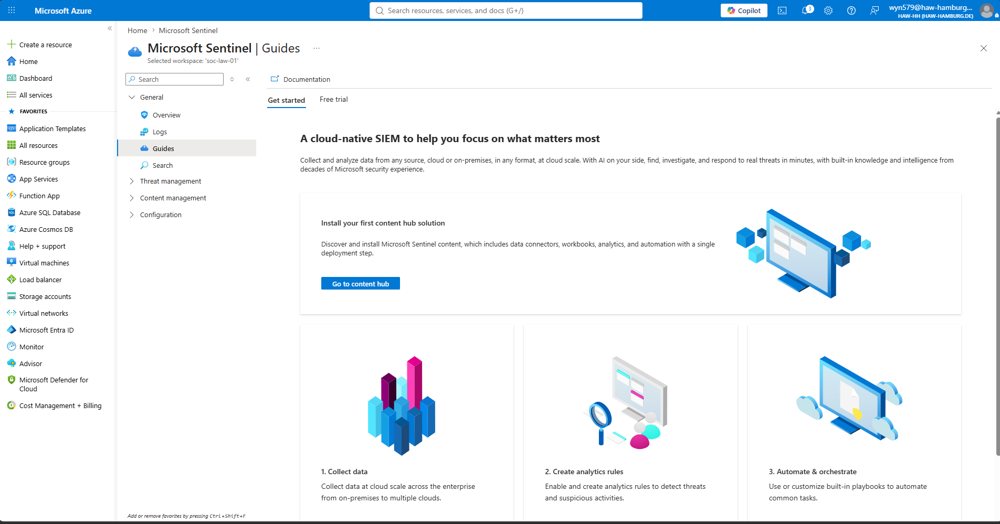
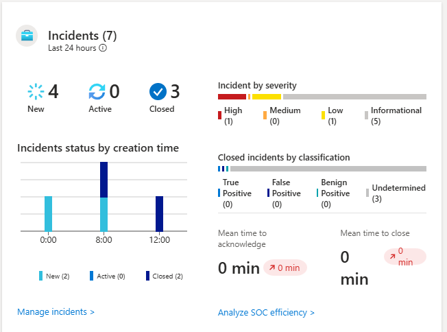
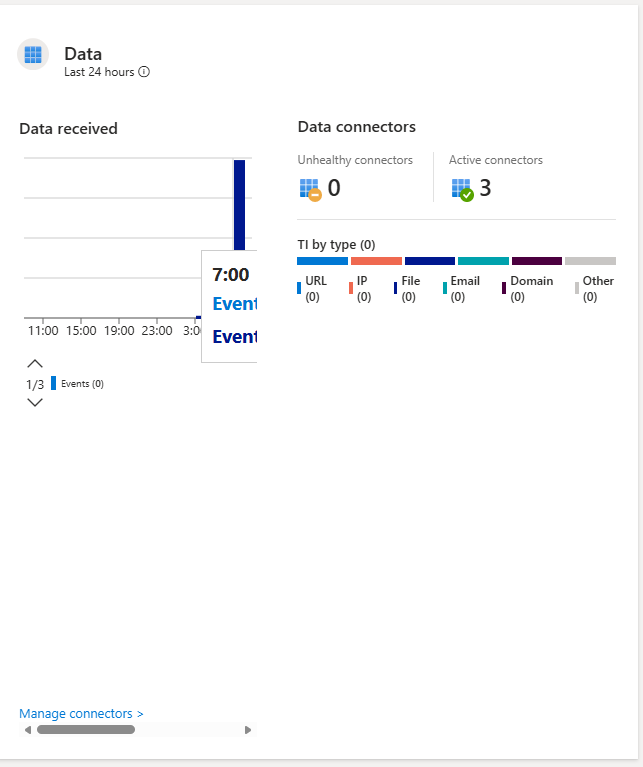
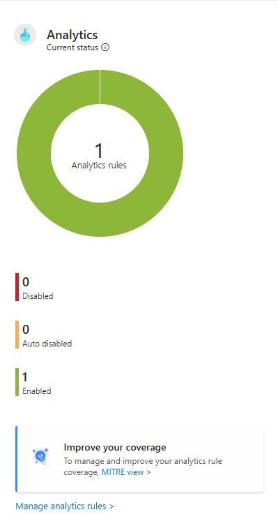
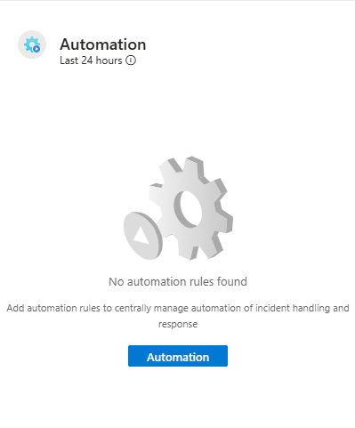

# Microsoft Sentinel Deployment

## Project Objective

The objective of this phase was to deploy Microsoft Sentinel and integrate it with the Azure Log Analytics Workspace to build the Security Information and Event Management (SIEM) platform for this SOC lab.

By enabling Microsoft Sentinel, the lab gains centralized visibility into security events collected from Azure resources, allowing for threat detection, incident investigation, threat hunting, and automated response.

---

## Why Microsoft Sentinel?

Microsoft Sentinel is Microsoft's cloud-native SIEM and SOAR solution. It provides security teams with a centralized platform for collecting, correlating, analyzing, and responding to security events across cloud and on-premises environments.

Within this lab, Microsoft Sentinel will be used to:

- Collect and analyze Windows Security Events
- Execute Kusto Query Language (KQL) queries
- Create custom analytics rules
- Generate security alerts
- Investigate incidents
- Map detections to the MITRE ATT&CK framework
- Automate incident response in later phases using Playbooks

---

## Configuration

| Setting | Value |
|----------|-------|
| Resource Group | Frank-SOC-Lab-RG |
| SIEM Platform | Microsoft Sentinel |
| Connected Workspace | SOC-LAW-WE-01 |
| Deployment Method | Azure Portal |

---

## Deployment

Microsoft Sentinel was successfully enabled and connected to the Log Analytics Workspace.

After deployment, the workspace became capable of ingesting security telemetry collected through Azure Monitor and Data Collection Rules. This provides the foundation for building analytics rules, investigating incidents, creating dashboards, and performing threat hunting activities.

---

# Microsoft Sentinel Overview

The Sentinel Overview dashboard provides a centralized view of the SOC environment, including incident management, analytics, data ingestion, and automation capabilities.

---

# Incident Management

The Incidents dashboard serves as the primary workspace for SOC analysts. It aggregates alerts generated by analytics rules into actionable incidents that can be investigated, classified, and resolved.

Key capabilities include:

- Monitoring newly created incidents
- Tracking active investigations
- Reviewing closed incidents
- Prioritizing incidents by severity
- Measuring analyst response times

---

# Data Connectors

Data connectors are responsible for bringing security telemetry into Microsoft Sentinel.

For this SOC lab, Windows Security Events are collected using the Azure Monitor Agent (AMA) and forwarded through Data Collection Rules (DCR) into the Log Analytics Workspace before becoming available for analysis.

The dashboard confirms that active connectors are successfully configured.

---

# Analytics

Analytics rules continuously evaluate incoming security telemetry to detect suspicious behavior.

As part of this project, a custom scheduled analytics rule was created to detect repeated Windows failed logon attempts (Event ID 4625), demonstrating the implementation of detection engineering using Kusto Query Language (KQL).

The Analytics dashboard confirms that the custom detection rule has been successfully enabled.

---

# Automation

Microsoft Sentinel integrates with Azure Logic Apps to automate incident response through Playbooks.

Automation can be used to:

- Send email or Teams notifications
- Isolate compromised devices
- Create tickets in external ITSM platforms
- Trigger investigation workflows
- Execute predefined response actions

No automation playbooks have been configured at this stage of the project. Automation will be implemented in a later phase.

---

## Skills Demonstrated

- Microsoft Sentinel Deployment
- SIEM Administration
- Azure Security Services
- Security Monitoring
- Threat Detection Fundamentals
- Incident Management
- Detection Engineering
- Cloud Security Operations

---

## Lessons Learned

Deploying Microsoft Sentinel transforms Azure Log Analytics into a fully functional cloud-native SIEM. While Log Analytics provides centralized storage for security telemetry, Sentinel adds the capabilities required to detect threats, investigate incidents, hunt for malicious activity, and automate security operations.

Understanding the relationship between Log Analytics, Azure Monitor Agent, Data Collection Rules, and Sentinel is fundamental to designing an effective SOC monitoring environment.

---

## Why This Matters in a SOC

Microsoft Sentinel acts as the operational platform used by SOC analysts to monitor, investigate, and respond to security events. Analysts rely on Sentinel to correlate telemetry from multiple data sources, prioritize security incidents, perform threat hunting using KQL, and coordinate incident response activities.

This deployment establishes the foundation upon which the remainder of the SOC lab—including log ingestion, analytics rules, investigations, dashboards, and automation—is built.
